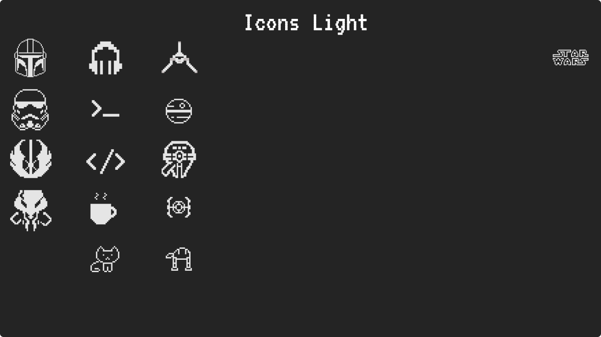

# pixels
Repositório de ícones feitos em pixel art utilizando a ferramenta Piskel.

Os ícones estão agrupados de acordo com as categorias: Colored, Dark e Light conforme ilustram as figuras abaixo.

  <h3>Icons Colored</h3>
  

 

  <h3>Icons Dark</h3>
  

 

  <h3>Icons Light</h3>
  

 
